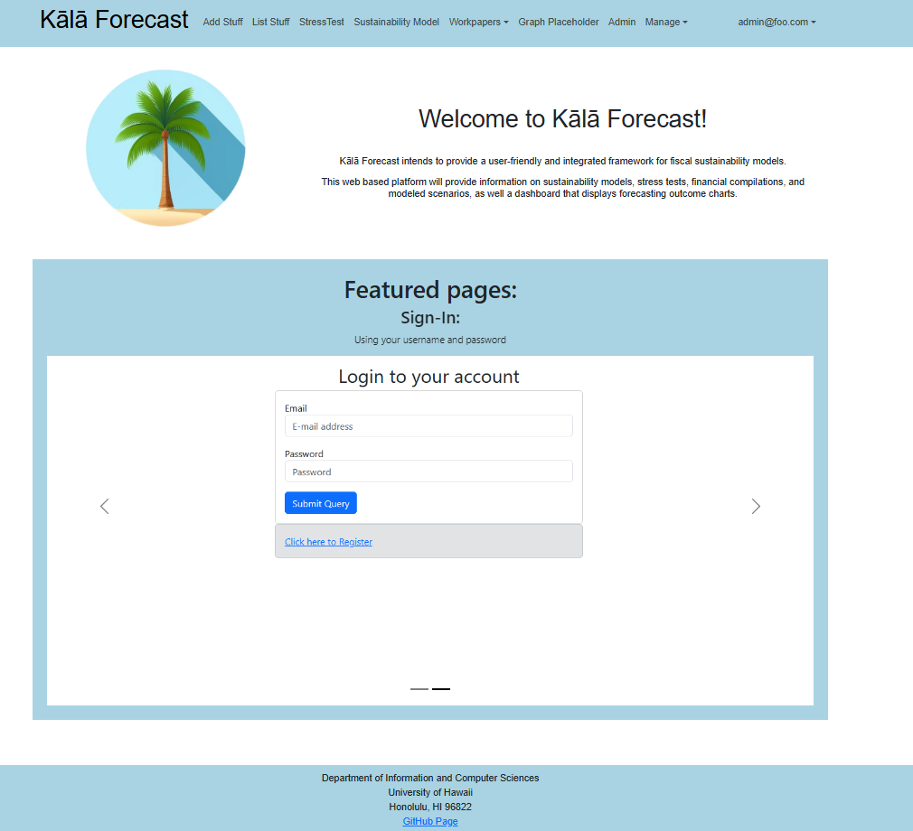
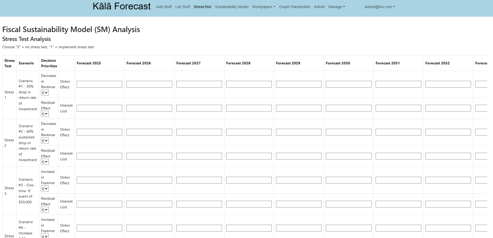
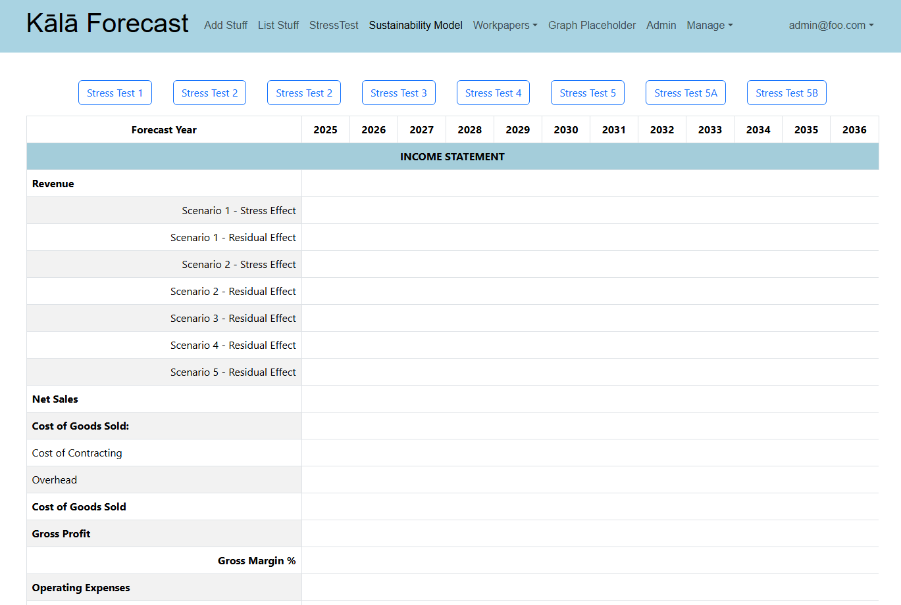
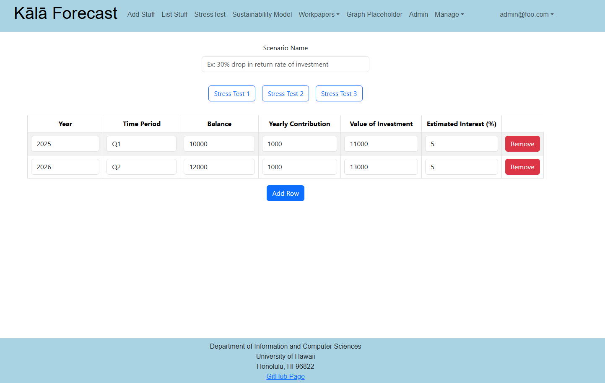
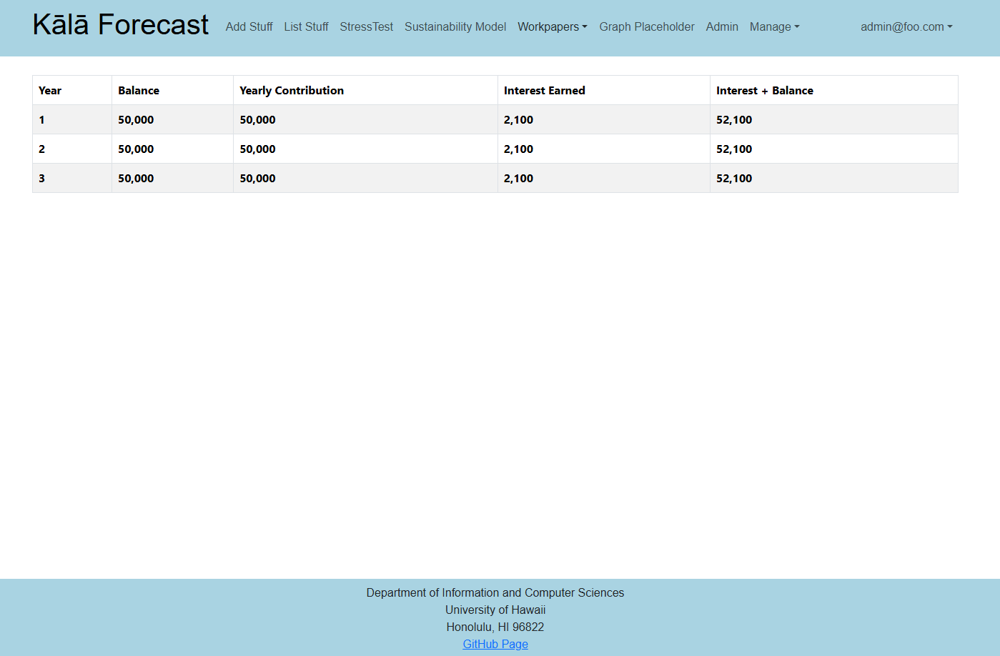
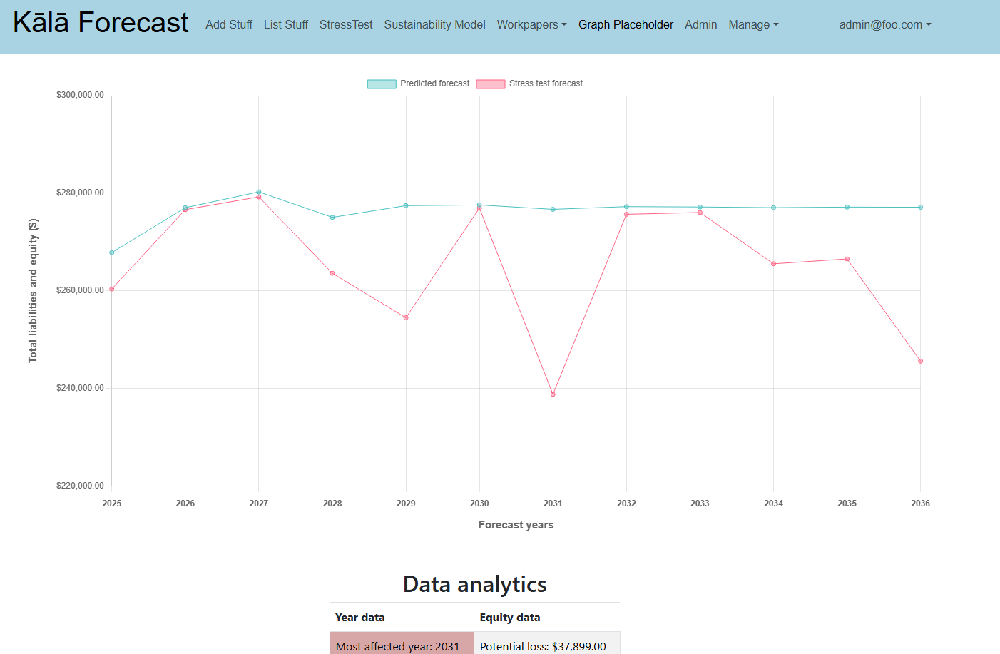

# Kālā Forecast

## Table of contents

* [Overview](#overview)
* [Deployment](#deployment)
* [User Guide](#user-guide)
* [Developer Guide](#developer-guide)
* [Team](#team)

    

## Overview

Kālā Forecast intends to provide a user-friendly and integrated framework for fiscal sustainability models. This web based platform will provide information on sustainability models, stress tests, financial compilations, and modeled scenarios, as well a dashboard that displays forecasting outcome charts. This platform strives to be easy to use for all, providing a customized user experience to each role within the company that best suits the needs of the individual.

## Deployment

Kālā Forecast is deployed [here](http://kalaforecast.org/). 

## User Guide

This section provides a walkthrough of Kālā Forecast's features and capabilities. It includes a brief description for its different usages and has an accompanying visual format that demonstrates them. 

### Landing Page

Welcome to our platform! Here, you’ll find an easy and intuitive alternative to excel sheets.

### Stress Test Page

### Sustainability Model

### Edit Workpapers

### View Workpapers

### Graph View

## Developer Guide

# Milestones:

[Milestone 1](https://github.com/orgs/kala-forecast/projects/3/views/1)

[Milestone 2](https://github.com/orgs/kala-forecast/projects/5)

## Team 
1. [Anastasia del Banco](https://ana-del-bench.github.io/)
2. [Kenneth de Guzman](https://k-deguz.github.io/)
3. [Hoopuiwa Perry](https://hoopuiwa.github.io/)
4. [Xingyao He](https://xingyao03.github.io/)
5. [Alyssa Greenwell](https://alyssa-greenwell.github.io/)
6. [Robert Maddox](https://robertmaddoxhi.github.io/)
7. [Adam Bell](https://belladam.github.io/)

> Team Contract: [View](https://docs.google.com/document/d/11B2C8RcwiY21vFOJFAc407h_RT3uLW6jFtNIv5lmNeg/edit?tab=t.0)

## Organization

> Github Organization: [View](https://github.com/kala-forecast)

## CI Status

